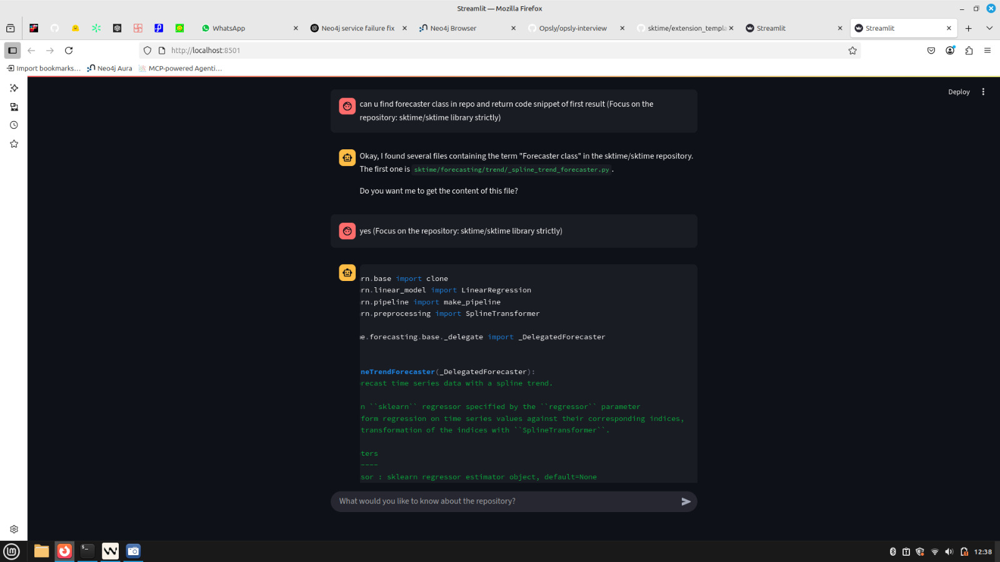

## MCP-Enhanced Code Search & Documentation


A powerful, extensible Q\&A and code-exploration system built on the Model Context Protocol (MCP). Designed to seamlessly query GitHub repositories, leverage an optional knowledge graph for NLP-driven Cypher queries, and deliver structured documentation summaries—all via an intuitive Streamlit interface.

---

## 🎯 Features

* **Modular MCP Servers**

  * File Content, Repo Structure, Code Search, and more
  * Conforms to MCP JSON-RPC tool spec
* **Optional Knowledge Graph**

  * Neo4j (or any Cypher-compatible DB) ingestion for faster, richer queries
* **LLM.txt Generator**

  * Auto-maps and summarizes repo with Dspy-powered prompts
* **Streamlit Q\&A Interface**

  * Chat-like UI with conversation history and tool usage indicators
* **High-Performance LLM**

  * Out-of-the-box support for Gemini 2 Flash (or any compatible LLM)

---

## 🚀 Demo




[View the demo video](simplescreenrecorder-2025-06-30_14.13.04.mkv)

[LINK TO EXTERNAL SITE FOR DEMO](https://vimeo.com/1097457204?share=copy)
---

## 📦 Tech Stack

| Component              | Technology                          |
| ---------------------- | ----------------------------------- |
| Language               | Python 3.8+                         |
| MCP Framework          | Custom JSON-RPC servers (MCP)       |
| Streamlit UI           | Streamlit                           |
| NLP & Summarization    | Dspy, LLM function-calling          |
| Knowledge Graph (Opt.) | Neo4j                               |
| LLM Backend            | Gemini 2 Flash                      |


---

## ⚙️ Installation

1. **Clone the repo**

   ```bash
   git clone https://github.com/YourUsername/opsly-solution-mcp.git
   cd opsly-solution-mcp
   ```
2. **Install dependencies**

   ```bash
   pip install -r requirements.txt
   ```

---

## 🔧 Configuration

1. **Environment Variables**

   ```bash
   export GITHUB_TOKEN=<your_token>      # for GitHub API rate limits
   export NEO4J_URI=bolt://localhost:7687 # if using Neo4j
   export NEO4J_USER=neo4j                
   export NEO4J_PASSWORD=<password>
   ```
2. **Optional: Knowledge Graph Setup**

   ```bash
   python knowledge/repo_cloner.py   # normalize files
   python knowledge/knowledge.py   # ingest into Neo4j
   ```

---

## 🚀 Usage

1. **Launch MCP Server**

   ```bash
   streamlit run app.py
   ```
3. **Interact via Browser**
   Navigate to `http://localhost:8501` to ask questions like:

   * *"What are the main entry points of this project?"*
   * *"Show all TODO comments in Python files."*
   * *"List files changed in the last 5 commits."*

---

## 🔗 Useful Links

* [MCP Spec & Examples](https://mcpserver.cc/server/github)
* [Dspy Documentation](https://dspy.ai/)
* [Gemini API (Function-Calling)](https://ai.google.dev/gemini-api/docs/function-calling)

---
